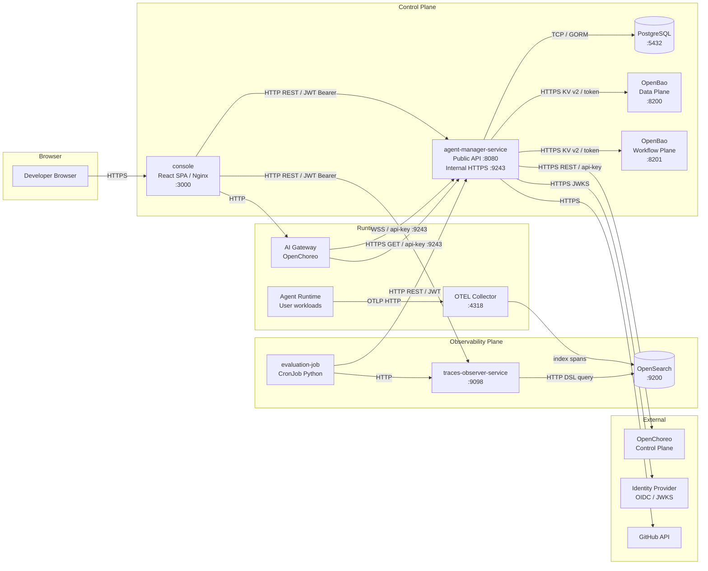

# WSO2 Agent Manager - Architecture Map Input

Fecha de generación: 2026-04-29
Objetivo: contexto estructurado para que un sistema de IA pueda generar un mapa de arquitectura (componentes, conexiones, redes/proxys y seguridad).

## 1) Resumen ejecutivo

WSO2 Agent Manager es un plano de control para agentes IA con dos modos principales:
- Gestión y despliegue de agentes (internos en OpenChoreo y externos).
- Observabilidad, gobierno y evaluación (trazas, métricas, monitores/evaluadores).

Componentes principales de plataforma:
- amp-api: backend Go (agent-manager-service)
- amp-console: frontend React/TypeScript
- amp-trace-observer: servicio Go para consulta de trazas en OpenSearch
- amp-evaluation-monitor: job Python para evaluación de trazas
- amp-python-instrumentation-provider + libs de instrumentación/evaluación

Referencia base:
- [README.md](README.md)

## 2) Mapa del repositorio (qué hay en cada sitio)

### Raíz
- [README.md](README.md): visión de plataforma y componentes.
- [docker-compose.yml](docker-compose.yml): stack local simple (Postgres, OpenBao, agent-manager, console).
- [start-local-amp.sh](start-local-amp.sh): arranque local AMP (k3d/podman, rollouts, port-forward).
- [stop-local-amp.sh](stop-local-amp.sh): stop de port-forwards locales.
- [restart-local-amp.sh](restart-local-amp.sh): restart completo; opción reprovision.
- [deployments](deployments): instalación y runtime Kubernetes/Helm/k3d.
- [documentation](documentation): documentación Docusaurus.

### Backend principal
- [agent-manager-service](agent-manager-service): API principal de control plane en Go.
  - [agent-manager-service/api](agent-manager-service/api): definición de rutas HTTP.
  - [agent-manager-service/controllers](agent-manager-service/controllers): handlers de negocio por dominio.
  - [agent-manager-service/services](agent-manager-service/services): lógica de negocio y orquestación.
  - [agent-manager-service/repositories](agent-manager-service/repositories): acceso a datos (DB).
  - [agent-manager-service/clients](agent-manager-service/clients): conectores externos.
  - [agent-manager-service/middleware](agent-manager-service/middleware): CORS, JWT, logging, recover.
  - [agent-manager-service/websocket](agent-manager-service/websocket): manager de conexiones gateway.
  - [agent-manager-service/config](agent-manager-service/config): configuración runtime.
  - [agent-manager-service/db_migrations](agent-manager-service/db_migrations): migraciones.
  - [agent-manager-service/spec](agent-manager-service/spec): contratos OpenAPI y modelos generados.

### Frontend
- [console](console): monorepo Rush + React/Vite.
  - apps/webapp: SPA principal.
  - workspaces/libs: auth, types, api-client, views.
  - workspaces/pages: páginas funcionales (agentes, llm providers, overview, etc.).

### Observabilidad
- [traces-observer-service](traces-observer-service): API de consulta de trazas en OpenSearch.
- [python-instrumentation-provider](python-instrumentation-provider): proveedor de instrumentación Python.
- [libs/amp-instrumentation](libs/amp-instrumentation): librería de instrumentación.

### Evaluación
- [evaluation-job](evaluation-job): job Python para evaluaciones de monitores.
- [libs/amp-evaluation](libs/amp-evaluation): SDK de evaluación.

### Despliegue
- [deployments/helm-charts](deployments/helm-charts): charts de plataforma y extensiones.
- [deployments/quick-start](deployments/quick-start): scripts de instalación local.
- [deployments/quick-start/k3d-config.yaml](deployments/quick-start/k3d-config.yaml): puertos expuestos y red k3d local.

### Ejemplos y utilidades
- [samples](samples): agentes de ejemplo.
- [scripts](scripts): scripts operativos auxiliares.
- [local-scripts](local-scripts): utilidades locales.

## 3) Componentes desplegables y responsabilidades

### 3.1 amp-api (agent-manager-service)
- Binario Go de control plane.
- Expone API pública versionada y API interna de gateway/ws.
- Gestiona agentes, builds/deployments, proxies LLM, proveedores LLM, secretos Git, monitores/evaluadores y trazas.

Referencias:
- [agent-manager-service/main.go](agent-manager-service/main.go)
- [agent-manager-service/api/app.go](agent-manager-service/api/app.go)
- [agent-manager-service/README.md](agent-manager-service/README.md)

### 3.2 amp-console
- UI de administración y operación.
- Consume amp-api, control plane gateway y endpoints de instrumentación/guardrails.

Referencias:
- [console/README.md](console/README.md)
- [console/apps/webapp/public/config.template.js](console/apps/webapp/public/config.template.js)

### 3.3 amp-trace-observer
- Servicio de lectura/agrupación de trazas en OpenSearch.
- Backend de la UI de trazas.

Referencias:
- [traces-observer-service/README.MD](traces-observer-service/README.MD)
- [traces-observer-service/main.go](traces-observer-service/main.go)
- [traces-observer-service/config/config.go](traces-observer-service/config/config.go)

### 3.4 amp-evaluation-monitor
- Job Python para workflows de evaluación de monitores.

Referencias:
- [evaluation-job/README.md](evaluation-job/README.md)

## 4) APIs y dominios funcionales (amp-api)

Rutas agrupadas por dominio:
- Agentes: create/list/get/update/delete/build/deploy/endpoints/config/metrics/logs.
  - [agent-manager-service/api/agent_routes.go](agent-manager-service/api/agent_routes.go)
- Tokens de agente y JWKS:
  - [agent-manager-service/api/agent_token_routes.go](agent-manager-service/api/agent_token_routes.go)
- Infra (orgs/proyectos/environments/deployment pipelines):
  - [agent-manager-service/api/infra_resource_routes.go](agent-manager-service/api/infra_resource_routes.go)
  - [agent-manager-service/api/environment_routes.go](agent-manager-service/api/environment_routes.go)
- Observabilidad de agentes (traces/export/trace detail):
  - [agent-manager-service/api/observability_routes.go](agent-manager-service/api/observability_routes.go)
- LLM providers/templates/proxies/deployments/api-keys:
  - [agent-manager-service/api/llm_routes.go](agent-manager-service/api/llm_routes.go)
  - [agent-manager-service/api/llm_deployment_routes.go](agent-manager-service/api/llm_deployment_routes.go)
  - [agent-manager-service/api/llm_provider_apikey_routes.go](agent-manager-service/api/llm_provider_apikey_routes.go)
  - [agent-manager-service/api/llm_proxy_apikey_routes.go](agent-manager-service/api/llm_proxy_apikey_routes.go)
  - [agent-manager-service/api/llm_proxy_deployment_routes.go](agent-manager-service/api/llm_proxy_deployment_routes.go)
- Gateways y health/tokens:
  - [agent-manager-service/api/gateway_routes.go](agent-manager-service/api/gateway_routes.go)
- API interna para gateways (descarga config de provider/proxy):
  - [agent-manager-service/api/gateway_internal_routes.go](agent-manager-service/api/gateway_internal_routes.go)
- WebSocket de gateways:
  - [agent-manager-service/api/websocket_routes.go](agent-manager-service/api/websocket_routes.go)
  - [agent-manager-service/controllers/websocket_controller.go](agent-manager-service/controllers/websocket_controller.go)
- Git secrets:
  - [agent-manager-service/api/git_secret_routes.go](agent-manager-service/api/git_secret_routes.go)
- Monitores, scores y publisher:
  - [agent-manager-service/api/monitor_routes.go](agent-manager-service/api/monitor_routes.go)
  - [agent-manager-service/api/monitor_publisher_routes.go](agent-manager-service/api/monitor_publisher_routes.go)
- Evaluadores y catálogo:
  - [agent-manager-service/api/evaluator_routes.go](agent-manager-service/api/evaluator_routes.go)
  - [agent-manager-service/api/catalog_routes.go](agent-manager-service/api/catalog_routes.go)

## 5) Conectores (integraciones externas e internas)

### 5.1 Conectores declarados en backend
- Git providers (incluye GitHub):
  - [agent-manager-service/clients/gitprovider/factory.go](agent-manager-service/clients/gitprovider/factory.go)
  - [agent-manager-service/clients/gitprovider/github.go](agent-manager-service/clients/gitprovider/github.go)
- OpenChoreo API client (control plane / data plane resources):
  - [agent-manager-service/clients/openchoreosvc](agent-manager-service/clients/openchoreosvc)
- Observability service client:
  - [agent-manager-service/clients/observabilitysvc/client.go](agent-manager-service/clients/observabilitysvc/client.go)
- Trace observer client:
  - [agent-manager-service/clients/traceobserversvc/client.go](agent-manager-service/clients/traceobserversvc/client.go)
- Secret manager client (OpenBao provider):
  - [agent-manager-service/clients/secretmanagersvc/client.go](agent-manager-service/clients/secretmanagersvc/client.go)
  - [agent-manager-service/clients/secretmanagersvc/providers/openbao](agent-manager-service/clients/secretmanagersvc/providers/openbao)

### 5.2 Conectores de observabilidad
- Traces Observer <-> OpenSearch:
  - [traces-observer-service/main.go](traces-observer-service/main.go)
  - [traces-observer-service/opensearch](traces-observer-service/opensearch)

### 5.3 Conectores de evaluación
- evaluation-job usa SDK amp-evaluation para leer trazas y publicar resultados de monitores.
  - [evaluation-job/main.py](evaluation-job/main.py)
  - [libs/amp-evaluation](libs/amp-evaluation)

## 6) Proxys y rutas de red (dónde van y vienen)

### 6.1 Flujos principales de aplicación
1. Usuario -> Console
- Navegador consume UI y autentica por OIDC.

2. Console -> amp-api
- REST para CRUD de agentes, LLM providers/proxies, monitores, etc.
- Base URL configurable.

3. amp-api -> OpenChoreo
- Provisioning/deployments y recursos de runtime.

4. amp-api -> OpenBao
- Gestión de secretos de despliegue y secretos Git.

5. Agente instrumentado -> OTEL Gateway
- Envío OTLP HTTP de trazas.

6. OTEL/OpenSearch stack -> amp-trace-observer
- Consulta de spans/trazas para UI y APIs.

7. amp-api -> amp-trace-observer
- Endpoints de trazas a nivel de agente/proyecto.

8. Gateway runtime -> amp-api API interna
- Pull de paquetes YAML de LLM provider/proxy mediante api-key.

9. Gateway runtime -> amp-api WebSocket
- Canal de conexión y señalización en tiempo real.

### 6.2 Tabla de conectividad (source -> target)
- Console -> amp-api
  - Protocolo: HTTP/HTTPS REST
  - Seguridad: JWT/OIDC del usuario
  - Config: API_BASE_URL
- Console -> Gateway control plane
  - Protocolo: HTTP/HTTPS
  - Seguridad: según entorno gateway
  - Config: GATEWAY_CONTROL_PLANE_URL
- amp-api -> Postgres
  - Protocolo: TCP 5432
  - Seguridad: credenciales DB
- amp-api -> OpenBao
  - Protocolo: HTTP 8200 (dev) / TLS en productivo
  - Seguridad: token OpenBao
- amp-api -> OpenChoreo APIs
  - Protocolo: HTTP/HTTPS
  - Seguridad: OAuth2 client credentials
- amp-api -> Trace Observer
  - Protocolo: HTTP
  - Seguridad: red interna/servicio
- Trace Observer -> OpenSearch
  - Protocolo: HTTP/HTTPS
  - Seguridad: usuario/password OpenSearch
- Gateway runtime -> amp-api internal (/api/internal/v1)
  - Protocolo: HTTPS 9243
  - Seguridad: header api-key
- Gateway runtime -> amp-api websocket (/api/internal/v1/ws/gateways/connect)
  - Protocolo: WSS
  - Seguridad: header api-key + rate limit

### 6.3 Puertos y exposición local relevantes
- docker-compose local:
  - agent-manager API: 9653 -> 8080
  - agent-manager internal HTTPS: 9243 -> 9243
  - console: 3000 -> 3000
  - postgres: 5432
  - openbao: 8200
  - Ref: [docker-compose.yml](docker-compose.yml)
- k3d quick-start (single cluster local):
  - AMP API 9000, internal 9243
  - Trace observer 9098
  - OTel 21893, observability gateway 22893/22894
  - OpenChoreo control plane 8080/8443
  - Data plane 19080/19443
  - Ref: [deployments/quick-start/k3d-config.yaml](deployments/quick-start/k3d-config.yaml)

## 7) Proxys lógicos de LLM

El proyecto distingue entre:
- LLM Provider: configuración de proveedor upstream.
- LLM Proxy: proxy gestionado por la plataforma para exponer/normalizar acceso al upstream.

Capacidades asociadas:
- CRUD provider/proxy.
- Deploy/undeploy/restore.
- Gestión y rotación de API keys por provider/proxy.

Referencias:
- [agent-manager-service/api/llm_routes.go](agent-manager-service/api/llm_routes.go)
- [agent-manager-service/api/llm_proxy_deployment_routes.go](agent-manager-service/api/llm_proxy_deployment_routes.go)
- [agent-manager-service/api/llm_provider_apikey_routes.go](agent-manager-service/api/llm_provider_apikey_routes.go)
- [agent-manager-service/api/llm_proxy_apikey_routes.go](agent-manager-service/api/llm_proxy_apikey_routes.go)

## 8) Seguridad (tipos y controles)

### 8.1 Autenticación y autorización
- API pública /api/v1:
  - JWT validation con JWKS remoto y validación issuer/audience.
  - Middleware: [agent-manager-service/middleware/jwtassertion/auth.go](agent-manager-service/middleware/jwtassertion/auth.go)
  - Wiring en app: [agent-manager-service/api/app.go](agent-manager-service/api/app.go)
- OIDC client credentials para integración service-to-service:
  - Config IDP token URL/client credentials.
  - [agent-manager-service/config/config.go](agent-manager-service/config/config.go)
- API interna y websocket para gateways:
  - Header api-key validado contra PlatformGatewayService.
  - [agent-manager-service/controllers/gateway_internal_controller.go](agent-manager-service/controllers/gateway_internal_controller.go)
  - [agent-manager-service/controllers/websocket_controller.go](agent-manager-service/controllers/websocket_controller.go)
- Emisión de tokens para agentes externos (JWT firmados) + JWKS público del servicio:
  - [agent-manager-service/api/agent_token_routes.go](agent-manager-service/api/agent_token_routes.go)

### 8.2 Gestión de claves y secretos
- JWT signing keys (private/public + key rotation):
  - [agent-manager-service/scripts/gen_keys.sh](agent-manager-service/scripts/gen_keys.sh)
- Secret manager provider OpenBao para secretos de data/workflow plane:
  - [agent-manager-service/clients/secretmanagersvc](agent-manager-service/clients/secretmanagersvc)
  - [deployments/helm-charts/wso2-agent-manager/values.yaml](deployments/helm-charts/wso2-agent-manager/values.yaml)
- Cifrado en reposo de secretos sensibles (AES-256-GCM con key de 32 bytes hex):
  - campo EncryptionKey en config
  - [agent-manager-service/config/config.go](agent-manager-service/config/config.go)

### 8.3 Transporte y TLS
- API interna en HTTPS con cert self-signed por defecto (desarrollo) y TLS>=1.2:
  - [agent-manager-service/server/internal_server.go](agent-manager-service/server/internal_server.go)
- Ingress con TLS opcional en chart:
  - [deployments/helm-charts/wso2-agent-manager/templates/ingress.yaml](deployments/helm-charts/wso2-agent-manager/templates/ingress.yaml)

### 8.4 CORS y hardening de acceso
- Middleware CORS para API pública/interna en backend.
  - [agent-manager-service/middleware/cors.go](agent-manager-service/middleware/cors.go)
- CORS en trace observer permite Authorization header.
  - [traces-observer-service/middleware/cors.go](traces-observer-service/middleware/cors.go)
- WebSocket con rate limiting por IP.
  - [agent-manager-service/controllers/websocket_controller.go](agent-manager-service/controllers/websocket_controller.go)

## 9) Configuración y variables clave

### 9.1 Backend (amp-api)
- DB: DB_HOST, DB_PORT, DB_USER, DB_PASSWORD, DB_NAME
- Auth/JWT/JWKS: AUTH_HEADER, KEY_MANAGER_ISSUER, KEY_MANAGER_AUDIENCE, KEY_MANAGER_JWKS_URL
- JWT signing interno: JWT_SIGNING_PRIVATE_KEY_PATH, JWT_SIGNING_PUBLIC_KEYS_CONFIG, JWT_SIGNING_ACTIVE_KEY_ID
- OIDC service credentials: IDP_TOKEN_URL, IDP_CLIENT_ID, IDP_CLIENT_SECRET
- OpenBao: OPENBAO_URL/TOKEN/PATH y WORKFLOW_PLANE_OPENBAO_*
- OTel: OTEL_EXPORTER_OTLP_ENDPOINT
- OpenChoreo: OPEN_CHOREO_BASE_URL
- Ref: [agent-manager-service/config/config.go](agent-manager-service/config/config.go)
- Ref helm config: [deployments/helm-charts/wso2-agent-manager/values.yaml](deployments/helm-charts/wso2-agent-manager/values.yaml)

### 9.2 Console
- AUTH_CLIENT_ID, AUTH_BASE_URL, SIGN_IN_REDIRECT_URL, SIGN_OUT_REDIRECT_URL
- DISABLE_AUTH
- API_BASE_URL
- GATEWAY_CONTROL_PLANE_URL
- INSTRUMENTATION_URL
- GUARDRAILS_CATALOG_URL, GUARDRAILS_DEFINITION_BASE_URL
- Ref: [console/apps/webapp/public/config.template.js](console/apps/webapp/public/config.template.js)
- Ref: [console/env.example](console/env.example)

### 9.3 Trace Observer
- OPENSEARCH_ADDRESS, OPENSEARCH_USERNAME, OPENSEARCH_PASSWORD, OPENSEARCH_TRACE_INDEX
- TRACES_OBSERVER_PORT
- Ref: [traces-observer-service/config/config.go](traces-observer-service/config/config.go)

## 10) Topología de despliegue recomendada (alto nivel)

Plano Control:
- Console
- amp-api
- OpenBao
- PostgreSQL
- OpenChoreo control APIs

Plano Observabilidad:
- OTEL gateway/collector
- OpenSearch
- amp-trace-observer

Plano Runtime/Gateway:
- Gateways conectando por WSS y API interna HTTPS a amp-api
- Agentes internos/externos enviando OTLP

## 11) Grafo lógico para generar diagrama (nodos y aristas)

### Nodos
- User Browser
- amp-console
- amp-api (public REST)
- amp-api internal (HTTPS + WSS)
- PostgreSQL
- OpenBao
- OpenChoreo API
- OIDC/Thunder IDP
- OTEL Gateway
- OpenSearch
- amp-trace-observer
- Gateway Runtime
- Agent Runtime (internal)
- Agent Runtime (external)
- Evaluation Job

### Aristas
- User Browser -> amp-console
- amp-console -> amp-api
- amp-console -> amp-api internal (control-plane ops)
- amp-api -> PostgreSQL
- amp-api -> OpenBao
- amp-api -> OpenChoreo API
- amp-api -> OIDC/Thunder IDP
- Agent Runtime (internal) -> OTEL Gateway
- Agent Runtime (external) -> OTEL Gateway
- OTEL Gateway -> OpenSearch
- amp-trace-observer -> OpenSearch
- amp-api -> amp-trace-observer
- Gateway Runtime -> amp-api internal (api-key)
- Gateway Runtime <-> amp-api internal (WebSocket WSS)
- Evaluation Job -> amp-api / traces / score publishing

## 12) Fuentes principales usadas

- [README.md](README.md)
- [docker-compose.yml](docker-compose.yml)
- [start-local-amp.sh](start-local-amp.sh)
- [restart-local-amp.sh](restart-local-amp.sh)
- [deployments/quick-start/k3d-config.yaml](deployments/quick-start/k3d-config.yaml)
- [deployments/helm-charts/wso2-agent-manager/values.yaml](deployments/helm-charts/wso2-agent-manager/values.yaml)
- [deployments/helm-charts/wso2-agent-manager/templates/ingress.yaml](deployments/helm-charts/wso2-agent-manager/templates/ingress.yaml)
- [agent-manager-service/main.go](agent-manager-service/main.go)
- [agent-manager-service/api/app.go](agent-manager-service/api/app.go)
- [agent-manager-service/config/config.go](agent-manager-service/config/config.go)
- [agent-manager-service/middleware/cors.go](agent-manager-service/middleware/cors.go)
- [agent-manager-service/middleware/jwtassertion/auth.go](agent-manager-service/middleware/jwtassertion/auth.go)
- [agent-manager-service/controllers/gateway_internal_controller.go](agent-manager-service/controllers/gateway_internal_controller.go)
- [agent-manager-service/controllers/websocket_controller.go](agent-manager-service/controllers/websocket_controller.go)
- [agent-manager-service/server/internal_server.go](agent-manager-service/server/internal_server.go)
- [traces-observer-service/README.MD](traces-observer-service/README.MD)
- [traces-observer-service/main.go](traces-observer-service/main.go)
- [traces-observer-service/config/config.go](traces-observer-service/config/config.go)
- [console/README.md](console/README.md)
- [console/apps/webapp/public/config.template.js](console/apps/webapp/public/config.template.js)
- [evaluation-job/README.md](evaluation-job/README.md)

## 13) Notas para la IA que dibuje el mapa

- Distinguir claramente API pública (/api/v1) de API interna (/api/internal/v1).
- Mostrar dos modelos de auth distintos: JWT/JWKS para público y api-key para runtime gateways.
- Dibujar plano de observabilidad separado del plano de control.
- Incluir OpenBao como secreto transversal (deployment secrets y git secrets).
- Marcar que la consola consume también URLs configurables de instrumentación/guardrails.
- Mostrar que el servidor interno usa TLS con self-signed por defecto en desarrollo.

---

## §14 — Referencia de Carpetas y Ficheros Clave

### `/` — Raíz del repositorio

| Ítem | Descripción |
|---|---|
| `start-local-amp.sh` | Arranca el entorno local completo (ver §15). |
| `stop-local-amp.sh` | Para el entorno local. |
| `restart-local-amp.sh` | Para y vuelve a arrancar (stop + start). |
| `docker-compose.yml` | Compose de alto nivel para entorno local dev. |
| `Dockerfile` | Imagen raíz (alias al servicio principal). |
| `Makefile` | Targets globales: `build`, `test`, `lint`, `deploy`. |
| `CONTRIBUTING.md` | Guía de contribución. |
| `README.md` | Documentación de inicio rápido. |

---

### `agent-manager-service/` — Control Plane Backend (Go)

Servicio principal: expone la API REST pública (`:8080`) y el servidor interno HTTPS (`:9243`).

| Carpeta / Fichero | Descripción |
|---|---|
| `main.go` | Punto de entrada. Carga config, inicializa wiring, arranca ambos servidores. |
| `go.mod` | Módulo Go. Dependencias clave: gorilla/mux, gorm, golang-jwt, hashicorp/vault/api. |
| `Makefile` | Targets: `build`, `test`, `lint`, `gen-client`, `gen-keys`, `gen-certs`. |
| `entrypoint.sh` | Entrypoint Docker: ejecuta migraciones y arranca el binario. |
| **`api/`** | Registro de rutas HTTP. `app.go` crea los dos handlers (público + interno) y aplica middlewares. Cada `*_routes.go` monta rutas de un dominio. |
| **`catalog/`** | Catálogo de evaluadores integrados. Contiene `builtin_evaluators.go` autogenerado. |
| **`clients/`** | Clientes HTTP para terceros: OpenChoreo, OpenBao, OpenSearch, IDP, GitHub. |
| **`config/`** | Struct `Config` con toda la configuración (DB, JWT, OIDC, OpenBao x2, TLS, CORS, OTEL…). |
| **`controllers/`** | Handlers HTTP, uno por dominio: agentes, gateways, websocket, evaluaciones, etc. |
| **`db/`** | Inicialización de la conexión GORM + PostgreSQL. |
| **`db_migrations/`** | Ficheros SQL de migración numerados. Se ejecutan en orden al arrancar. |
| **`docs/`** | OpenAPI spec (`api_v1_openapi.yaml`) y documentación Swagger. |
| **`keys/`** | Par de claves RSA para firmar JWT en dev local. |
| **`middleware/`** | `jwtassertion/auth.go` (RS256+JWKS), `cors.go`, `logging.go`. |
| **`models/`** | Structs GORM que mapean tablas de PostgreSQL. |
| **`repositories/`** | Capa de acceso a datos (CRUD sobre modelos). |
| **`resources/`** | Ficheros estáticos embebidos en el binario (SQL seeds, certificados raíz). |
| **`scripts/`** | Scripts de desarrollo (ver §15). |
| **`server/`** | Arranque de los dos servidores HTTP. `internal_server.go` genera/carga el certificado TLS self-signed. |
| **`services/`** | Capa de negocio. Orquesta repositories + clients. Un fichero por dominio. |
| **`signals/`** | Manejo de señales OS (SIGTERM, SIGINT) para graceful shutdown. |
| **`spec/`** | Output temporal del generador de cliente OpenAPI (ignorado en git). |
| **`tests/`** | Tests de integración con base de datos de test aislada. |
| **`utils/`** | Utilidades: cifrado AES-256-GCM, generación de tokens, helpers. |
| **`websocket/`** | Gestión de conexiones WebSocket (mapa de gateways conectados, broadcast). |
| **`wiring/`** | Inyección de dependencias (google/wire): config → repositories → services → controllers. |

---

### `console/` — Frontend SPA (React 19 + TypeScript + Rush)

Monorepo Rush con Vite. Dashboard de gestión de agentes.

| Carpeta / Fichero | Descripción |
|---|---|
| `rush.json` | Configuración del monorepo Rush (versiones, workspaces). |
| `dev-start.sh` | Dev entrypoint del contenedor: genera `config.js` con `envsubst` y arranca `tsc --watch`. |
| `env-config.sh` | Entrypoint producción dev-server: genera `config.js` y lanza `serve`. |
| `nginx.conf` | Config Nginx para servir la SPA en producción. |
| **`apps/webapp/`** | Aplicación React principal. Páginas, componentes, rutas, providers de auth. `public/config.template.js` es la plantilla de configuración runtime. |
| **`common/`** | Librerías internas compartidas: auth, UI components, API clients. |
| **`workspaces/pages/`** | Micro-frontends por dominio (agentes, evaluaciones, gateways…). |
| **`workspaces/pages/eval/`** | Editor de evaluadores con Monaco Editor y modelos autogenerados. |
| **`scripts/`** | Scripts de CI para el monorepo. |
| **`scripts/40-config-setup.sh`** | Nginx init script: genera `config.js` desde plantilla en `/usr/share/nginx/html/`. |
| `AGENTS.md` | Instrucciones para agentes de IA sobre cómo trabajar con este workspace. |

---

### `deployments/` — Infraestructura y Despliegue

| Carpeta / Fichero | Descripción |
|---|---|
| `docker-compose.yml` | Compose completo con todos los servicios locales (AMP + OpenBao + PG + OpenSearch + APIM). |
| `k3d-local-config.yaml` | Configuración del cluster k3d local (puertos expuestos, registry). |
| **`helm-charts/`** | Charts Helm para desplegar AMP en Kubernetes. Un chart por componente. |
| **`quick-start/`** | Scripts de instalación/desinstalación en un comando (ver §15). |
| **`scripts/`** | Scripts de setup y teardown del entorno k3d (ver §15). |
| **`single-cluster/`** | Manifiestos Kubernetes para despliegue en un único cluster sin OpenChoreo. |
| **`values/`** | Ficheros de valores Helm por entorno (local, staging, prod). |
| **`apim46-safe-clone/`** | Clone seguro de WSO2 APIM 4.6.0: overlays de configuración, scripts y binarios de APIM. |

---

### `traces-observer-service/` — Observabilidad (Go)

Servicio ligero que expone API HTTP para consultar trazas en OpenSearch.

| Carpeta / Fichero | Descripción |
|---|---|
| `main.go` | Punto de entrada. Arranca servidor HTTP (default :9098). |
| `openapi.yaml` | Spec OpenAPI del servicio de trazas. |
| **`config/`** | Struct de configuración (OpenSearch URL, credenciales, puerto). |
| **`controllers/`** | Handlers HTTP de las rutas de trazas. |
| **`handlers/`** | Lógica de procesamiento: paginación, filtros, transformación de resultados. |
| **`middleware/`** | CORS, logging, auth. |
| **`opensearch/`** | Cliente OpenSearch: queries DSL, índices, mapeo de resultados. |
| **`scripts/`** | Scripts de tests con y sin cobertura (ver §15). |

---

### `evaluation-job/` — Job de Evaluación (Python)

CronJob Kubernetes que evalúa trazas de agentes contra monitores configurados.

| Fichero | Descripción |
|---|---|
| `main.py` | Lógica principal: obtiene trazas, aplica evaluadores, persiste resultados. |
| `test_main.py` | Tests unitarios. |
| `pyproject.toml` | Configuración del proyecto Python (dependencias, tooling). |
| `requirements.txt` | Dependencias Python para el entorno de ejecución. |
| `Dockerfile` / `Dockerfile.dev` | Imágenes del job. |

---

### `libs/` — Librerías Compartidas

| Carpeta | Descripción |
|---|---|
| `amp-evaluation/` | SDK Python de evaluación. Define API de evaluadores, métricas y tipos. Usado por `evaluation-job` y el generador de modelos de la consola. |
| `amp-instrumentation/` | SDK de instrumentación OTEL. Facilita la emisión de trazas desde runtimes de agentes. |

---

### `documentation/` — Docs (Docusaurus)

Site Docusaurus con documentación pública versionada. Contiene docs, sidebars y configuración de build.

---

### `samples/` — Agentes de Ejemplo

| Carpeta | Descripción |
|---|---|
| `customer-support-agent/` | Agente de soporte al cliente de ejemplo integrado con AMP. |
| `hotel-booking-agent/` | Agente de reserva de hoteles de ejemplo. |

---

### `python-instrumentation-provider/` — Proveedor de Instrumentación Python

Inyecta automáticamente la instrumentación OTEL en runtimes Python. `sitecustomize.py` se ejecuta al inicio del intérprete Python.

---

### `local-scripts/` — Utilidades de Caché Local

Scripts para acelerar el entorno dev local (cachear imágenes de buildpacks en el registry k3d).

---

### `config/` — Configuración Global

Ficheros de configuración global compartidos entre servicios, no específicos de un único componente.

---

## §15 — Catálogo de Shell Scripts

### Scripts raíz (operación local)

| Script | Quién | Cuándo | Descripción |
|---|---|---|---|
| `start-local-amp.sh` | Desarrollador | Manual | Arranca el entorno AMP local completo: carga `.amp-local.env`, crea dirs de estado/logs/pids, orquesta servicios (docker-compose + k3d). Escribe `status.txt`. |
| `stop-local-amp.sh` | Desarrollador | Manual | Para todos los procesos arrancados, leyendo PIDs en `.amp-local/pids/`. Muestra colores en terminal interactivo. |
| `restart-local-amp.sh` | Desarrollador | Manual | Llama a `stop-local-amp.sh` y luego `start-local-amp.sh`. Carga `.amp-local.env` si existe. |

---

### `.github/scripts/` — CI/CD

| Script | Quién | Cuándo | Descripción |
|---|---|---|---|
| `package-helm-chart.sh` | CI (GitHub Actions) | Release | Empaqueta los Helm charts en `.tgz` y los prepara para publicar en el registry OCI. |
| `update-helm-charts.sh` | CI | Release | Actualiza versiones y dependencias en los `Chart.yaml` antes del empaquetado. |
| `update-install-helpers.sh` | CI | Release | Actualiza `install-helpers.sh` con la versión de release correcta. |

---

### `agent-manager-service/` — Desarrollo del servicio Go

| Script | Quién | Cuándo | Descripción |
|---|---|---|---|
| `entrypoint.sh` | Docker | Arranque | Ejecuta migraciones de DB y lanza el binario compilado. |
| `scripts/fmt.sh` | Dev / CI | Pre-commit | Formatea código Go con `gofmt` y `goimports`. |
| `scripts/gen_certs.sh` | Dev | Setup inicial | Genera certificados TLS auto-firmados RSA 2048 para el servidor interno. Guarda en `./data/certs/`. |
| `scripts/gen_client.sh` | Dev | Al cambiar spec | Genera cliente Go para OpenChoreo a partir del OpenAPI spec via `openapi-generator-cli`. |
| `scripts/gen_keys.sh` | Dev / CI | Setup / tests | Genera par de claves RSA para firmar JWT en dev. Guarda en `keys/`. |
| `scripts/generate-builtin-evaluators.sh` | Dev | Al cambiar `amp-evaluation` | Genera `catalog/builtin_evaluators.go` desde la librería Python `amp-evaluation`. El fichero se compila en el binario. |
| `scripts/lint.sh` | Dev / CI | Pre-commit / CI | Ejecuta `goimports` + `golangci-lint` con auto-fix. `goheader` corre separado sin `--fix`. |
| `scripts/newline.sh` | CI | Pre-commit hook | Verifica que `.go`, `.sh`, `.yaml`, `.md` terminen con salto de línea. |
| `scripts/run_tests_isolated.sh` | Dev / CI | Tests con DB real | Carga `.env.test`, ejecuta migraciones en DB de test y lanza `go test`. |
| `scripts/run_tests.sh` | Dev / CI | Tests rápidos | Carga `.env`, genera claves RSA si no existen, lanza `go test`. |

---

### `console/` — Frontend

| Script | Quién | Cuándo | Descripción |
|---|---|---|---|
| `dev-start.sh` | Docker (dev) | Arranque dev | Genera `config.js` con `envsubst`, luego arranca `tsc --watch` en todos los workspaces con `tsconfig.lib.json`. |
| `env-config.sh` | Docker (prod-like) | Arranque | Genera `config.js` desde plantilla y arranca `serve -s /app/dist -l 3000`. |
| `scripts/40-config-setup.sh` | Nginx init | Arranque Nginx | Genera `config.js` en `/usr/share/nginx/html/` antes de que Nginx sirva tráfico. |
| `workspaces/pages/eval/scripts/generate-evaluator-models.sh` | Dev | Al cambiar `amp-evaluation` | Genera `evaluator-models.generated.ts` con modelos Monaco para el editor de evaluadores (completions, templates, hover docs). |

---

### `deployments/quick-start/` — Instalación en un comando

| Script | Quién | Cuándo | Descripción |
|---|---|---|---|
| `install.sh` | Usuario final | Primera instalación | Setup completo idempotente: crea cluster k3d, instala OpenChoreo (todos los planos), registra planos, instala AMP vía Helm. |
| `uninstall.sh` | Usuario final | Desinstalación | Elimina Helm releases de AMP y OpenChoreo, Custom Resources, opcionalmente el cluster k3d. Acepta `--amp-only`. |
| `install-helpers.sh` | `install.sh` (source) | Interno | Funciones helper para instalar AMP desde el registry Helm público. Define `VERSION` a instalar. |
| `entrypoint.sh` | Docker (quick-start) | Arranque | Ajusta permisos del socket Docker para el usuario `wso2-amp` y arranca el proceso principal. |

---

### `deployments/scripts/` — Setup de infraestructura k3d

| Script | Quién | Cuándo | Descripción |
|---|---|---|---|
| `env.sh` | Otros scripts (source) | Siempre | Define variables compartidas: `OPENCHOREO_VERSION`, `CLUSTER_NAME`, `CLUSTER_CONTEXT`. No se ejecuta directamente. |
| `utils.sh` | Otros scripts (source) | Siempre | Funciones utilitarias: `is_port_in_use()`, `check_required_ports()`, helpers de logging. No se ejecuta directamente. |
| `setup-prerequisites.sh` | Dev | Primera vez | Verifica e instala herramientas: docker, kubectl, helm, k3d. Fija versiones. |
| `setup-colima.sh` | Dev (macOS) | Primera vez | Configura Colima (runtime Docker en macOS) con el perfil especificado. |
| `setup-k3d.sh` | Dev / CI | Setup cluster | Crea el cluster k3d. Idempotente: detecta si ya existe. |
| `setup-openchoreo.sh` | Dev / CI | Post-k3d | Instala OpenChoreo en el cluster k3d vía Helm. |
| `setup-platform.sh` | Dev / CI | Post-OpenChoreo | Despliega servicios AMP vía docker-compose y aplica configuración de plataforma en el cluster. |
| `bootstrap-gateway.sh` | CI / Job K8s | Post-install | Registra el AI gateway en AMP, genera token de registro y lo escribe en fichero compartido para el gateway-controller. |
| `port-forward.sh` | Dev | Debug local | Configura `kubectl port-forward` para todos los servicios de OpenChoreo y AMP en localhost. |
| `teardown.sh` | Dev | Limpieza | Para servicios docker-compose, elimina recursos del cluster, opcionalmente destruye el cluster k3d. |

---

### `deployments/apim46-safe-clone/` — WSO2 APIM 4.6.0

| Script | Quién | Cuándo | Descripción |
|---|---|---|---|
| `container/apim-entrypoint.sh` | Docker (APIM) | Arranque | Valida variables de entorno requeridas y lanza APIM. |
| `scripts/extract-safe-overlay.sh` | Dev | Build | Copia overlays de configuración (dropins, lib) desde `APIM_HOME` a `build-overlay/`. |
| `scripts/stage-local-product-home.sh` | Dev | Setup local | Prepara el directorio local `product-home` copiando archivos desde `APIM_HOME`. |
| `staging/.../bin/api-manager.sh` | Dev / Container | Arranque APIM | Script oficial WSO2 para arrancar/parar APIM 4.6.0. Acepta `start`, `stop`, `restart`. |
| `staging/.../bin/start_apim.sh` | Dev | Arranque local | Wrapper sobre `api-manager.sh` que fuerza Java 11 antes de lanzar APIM. |
| `staging/.../bin/carbondump.sh` | Soporte | Diagnóstico | Genera thread dump de la JVM de APIM. |
| `staging/.../bin/chpasswd.sh` | Admin | Mantenimiento | Cambia contraseña del admin Carbon/APIM. |
| `staging/.../bin/ciphertool.sh` | Admin | Seguridad | Cifra contraseñas en ficheros de configuración de APIM con Cipher Tool. |
| `staging/.../bin/fips.sh` | Admin | Seguridad | Activa/desactiva modo FIPS en APIM. |
| `staging/.../bin/java2wsdl.sh` | Dev | Utilidad | Genera WSDL desde clases Java (Axis2). |
| `staging/.../bin/wsdl2java.sh` | Dev | Utilidad | Genera stubs Java desde WSDL (Axis2). |
| `staging/.../bin/tcpmon.sh` | Dev | Debug red | Lanza TCPMon para monitorizar tráfico TCP/HTTP. |
| `staging/.../diagnostics-tool/bin/diagnostics.sh` | Soporte | Diagnóstico | Herramienta de diagnóstico oficial WSO2 para recopilar info del entorno APIM. |

---

### `local-scripts/`

| Script | Quién | Cuándo | Descripción |
|---|---|---|---|
| `cache-buildpack-images.sh` | Dev | Una vez | Descarga y re-etiqueta imágenes de buildpacks (lifecycle, Google builder) en el registry k3d local para evitar pulls de internet en builds posteriores. |

---

### `traces-observer-service/scripts/`

| Script | Quién | Cuándo | Descripción |
|---|---|---|---|
| `run_tests.sh` | Dev / CI | Tests | Carga `.env` si existe y ejecuta `go test`. |
| `run_tests_with_coverage.sh` | CI | CI / coverage | Como `run_tests.sh` pero genera informe de cobertura de código. |

---

## §16 — Diagrama Mermaid

