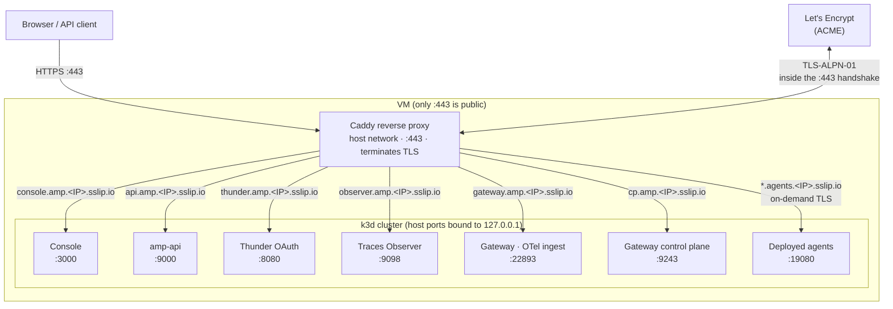
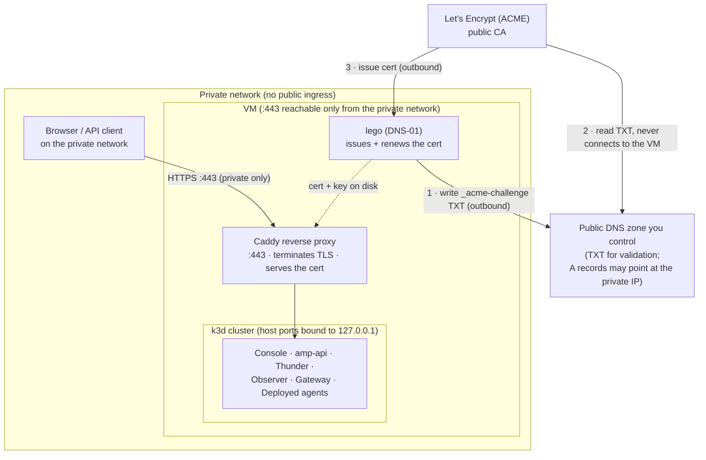

import Tabs from '@theme/Tabs';
import TabItem from '@theme/TabItem';

# Run Agent Manager on a VM with Docker

:::warning Not recommended for production use

Both installation paths on this page **Simple** and **Advanced** are intended for **evaluation, demos, and proof-of-concept** use only. Do not use them to run production workloads or to handle sensitive or regulated data.

For production, run Agent Manager on a properly operated Kubernetes platform with high availability, a managed and backed-up database, secret management, monitoring, and a hardened, redundant ingress following your organization's production practices. Use these installers to try Agent Manager out, not to run it for real.

:::

Install Agent Manager on a Linux VM where Docker is the only host dependency. Pick the path that fits you:

- **Simple**: give the installer the VM's public IP and it does everything else: hostnames are derived from the IP via [sslip.io](https://sslip.io) and TLS certificates are issued automatically by Let's Encrypt. No domain, no DNS setup, no certificate handling. Best for demos and quick evaluations.
- **Advanced**: a config-file-driven installer for a **custom domain**, on a VM that is either publicly reachable or **private-network-only**. Choose how TLS is handled: automatic Let's Encrypt, the DNS-01 challenge for a private VM, your own certificate, a generated local CA, or a load balancer in front. Adds pre-flight validation of your config, certificates, and DNS.

<Tabs groupId="vm-installer">
<TabItem value="simple" label="Simple (IP + automatic TLS)" default>

The simple installer exposes the platform over HTTPS using [sslip.io](https://sslip.io) hostnames derived from the VM's public IP, so there's no domain registration and no client `/etc/hosts` edits.

## Prerequisites

You only need an SSH client to log into the VM; everything else runs on the VM.
- **Git** to clone this repository and fetch the installer. This is the one tool you need *before* running the script (the script can't install what you use to download it). Most images have it; on a minimal one install it with `sudo apt-get update && sudo apt-get install -y git` (Debian/Ubuntu).
- **Docker** is required; the whole stack runs on it (k3d runs the Kubernetes cluster as Docker containers, and Caddy runs as a container). If Docker isn't already installed, the script installs it for you, along with k3d, kubectl, helm, and lsof.
- A Linux VM with a **static (reserved) public IP** and SSH access (sudo). The install derives every hostname, TLS certificate, and OAuth issuer from the IP (`*.amp.<IP>.sslip.io`), so a **changing IP breaks the install**, and stopping the VM (for example to resize its disk) releases an ephemeral IP. Reserve the address before installing. If the IP ever changes, reinstall against the new IP.
- **At least 50 GB of disk.** Building and running agents pushes the in-cluster image store past 13 GB; on a smaller disk the node hits `DiskPressure`, which evicts pods and can take cluster DNS down mid-build.
- **At least 4 vCPUs and 8 GB of RAM** to run the full k3d + OpenChoreo + Agent Manager stack comfortably.
- **Inbound `443/tcp` open** in the cloud security group / firewall, and only 443. Certificates issue via the TLS-ALPN-01 ACME challenge, which runs inside the `:443` TLS handshake, so no inbound port 80 is ever needed. The `:443` exposure must be **TCP passthrough** (not a TLS-terminating load balancer in front), since the challenge happens inside the handshake.

## Install

SSH into the VM, get the installer, and run it with `sudo`:

```bash
# on the VM
git clone https://github.com/wso2/agent-manager.git
cd agent-manager/deployments/vm
git checkout tags/amp/v0.0.0-dev

sudo ./install-vm.sh \
  --host <VM_PUBLIC_IP> \
  --version 0.0.0-dev \
  --email you@example.com
```

Pass `--host` the VM's **public** IPv4 address. A cloud VM usually can't read its own public IP (it's NAT'd behind the address you used to SSH in), so the installer needs it to build the `*.amp.<IP>.sslip.io` hostnames.

The installer runs in two phases: bootstrap (Docker + tools + firewall) and the platform install + Caddy startup. Allow 8-15 minutes. It needs `sudo` because it installs Docker, opens the firewall, and creates the cluster.

### Options

| Flag | Default | Purpose |
|---|---|---|
| `--host` | _(required)_ | The VM's public IPv4 address |
| `--version` | _(required)_ | Agent Manager release to install; use the same `amp/v*` tag you checked out above |
| `--email` | _(none)_ | ACME contact for expiry notices |
| `--no-external-gateways` | off | Drop the gateway control-plane endpoint if you won't connect external gateways |

## What gets exposed

The installer fronts the stack with [Caddy](https://caddyserver.com), an open-source web server that terminates TLS, obtains and renews Let's Encrypt certificates automatically, and reverse-proxies each public hostname to the right service. It runs as a single `amp-caddy` Docker container and is the only process listening on the internet-facing ports.

Only `:443` faces the internet; all other service ports are bound to the VM's loopback and reached only by Caddy.



Every public hostname resolves to the VM's IP (via sslip.io) and arrives at Caddy on `:443`; Caddy terminates TLS and reverse-proxies to the matching loopback port. Certificates are obtained over that same `:443` using the TLS-ALPN-01 challenge, so no inbound port 80 is needed. The deployed-agent wildcard gets its certificate on demand at first request.

| URL | Purpose |
|---|---|
| `https://console.amp.<IP>.sslip.io` | Console UI |
| `https://api.amp.<IP>.sslip.io` | Agent Manager API (used by `amctl`) |
| `https://thunder.amp.<IP>.sslip.io` | Thunder OAuth (login) |
| `https://observer.amp.<IP>.sslip.io` | Traces Observer |
| `https://gateway.amp.<IP>.sslip.io/otel` | OTel trace ingest from deployed agents |
| `https://<org>-<project>.agents.<IP>.sslip.io/...` | Deployed-agent invocation endpoints (one wildcard host per org/project) |
| `https://cp.amp.<IP>.sslip.io` | Gateway control plane; connect external gateways here (on by default) |

## Log in

Open `https://console.amp.<IP>.sslip.io` and sign in as the seeded Agent Manager admin user **`amp-admin`** (password **`amp-admin`**). This user holds the AMP `admin` role, which grants every application permission.

From the `0.16.0` release, role-based access control is enforced on the API (`rbacEnabled`), so the token must carry the right scopes. Note that Thunder's own system account (`admin` / `admin`, shown in the bootstrap logs) is **not** granted the Agent Manager application role. Signing in with it lets you reach the console, but every API call fails with `403 insufficient permissions`. Always use `amp-admin`.

## Deployed-agent invocation

When you deploy an agent, its endpoint is published on a per-project host `<org>-<project>.agents.<IP>.sslip.io` and routed by Caddy to the OpenChoreo data-plane gateway. Because these hostnames are dynamic (a new one per org/project), Caddy issues their TLS certificates **on demand** at the first request (via the same ACME challenge as the fixed hosts), rather than up front. Invocations are authenticated with a user token that the gateway validates against the public Thunder issuer.

Because issuance is on demand and uses TLS-ALPN-01 (the challenge runs inside the `:443` handshake), the **very first request to a newly-deployed agent host can fail with a one-time certificate error**, most visibly `ERR_CERTIFICATE_TRANSPARENCY_REQUIRED` in Chrome. That first connection is consumed by Caddy answering the ACME challenge, so the browser briefly sees the challenge certificate instead of the real one. Issuance completes within a second or two; reload the page (or open it in a fresh tab) and it serves the trusted Let's Encrypt certificate. This only affects the first hit per new agent host; the certificate is then cached in the `amp-caddy-data` volume.

amp-api advertises each agent endpoint with the `https://` scheme (the installer sets `tlsEnabled` on the service), so the console (and any other caller) invokes it over TLS directly through the wildcard site.

## TLS

Caddy obtains and auto-renews trusted Let's Encrypt certificates on first start, with no manual certificate steps. Issuance uses the **TLS-ALPN-01** challenge, which runs inside the `:443` TLS handshake, so only inbound 443 is ever required and there is no port-80 dependency. Certificates and the ACME account persist in the `amp-caddy-data` Docker volume, so restarts do not re-request them.

Because the challenge happens inside the TLS handshake, the public `:443` must reach Caddy as **raw TCP**; do not put a TLS-terminating load balancer in front of the VM. There is no `:80` listener, so plain `http://` URLs are not served (no automatic http→https redirect); always use the `https://` URLs the installer prints.

## Persistence and teardown

Application data (PostgreSQL), issued certificates, and the k3d cluster persist across Docker/host restarts via named volumes. To tear down completely, delete the cluster, then remove the Caddy front door and its volumes (which hold the issued certificates and ACME account):

```bash
cd agent-manager/deployments/quick-start
sudo ./uninstall.sh --delete-cluster                    # delete the k3d cluster (workloads + app data)
sudo docker rm -f amp-caddy                              # remove the Caddy front door
sudo docker volume rm amp-caddy-data amp-caddy-config    # drop the cached certs + ACME account
```

Use `sudo`; the installer runs Docker and k3d as root. Plain `./uninstall.sh` (without `--delete-cluster`) only removes the Helm releases and leaves the cluster running; `uninstall.sh` does not touch the Caddy container or its volumes, so remove those separately as shown.

## Connect an external gateway

Agent Manager can drive external WSO2 AI gateways. The control-plane endpoint `https://cp.amp.<IP>.sslip.io` is exposed by default for this. In the console, open **Infrastructure → Gateways**, generate a registration token, and follow the generated commands, which point the gateway at `cp.amp.<IP>.sslip.io:443`, where it opens a control WebSocket and pulls its configuration. If you do not need external gateways, install with `--no-external-gateways` to drop this endpoint.

**Security:** the registration token grants a gateway your LLM-provider API keys and proxy credentials. Treat it as a secret, revoke/regenerate it from the Gateways page when a gateway is decommissioned, and optionally restrict `cp.amp...` to known gateway source IPs at the firewall.

## Troubleshooting

- **Certificates never issue / hosts unreachable from outside.** Open inbound `:443` in your cloud security group / NACL, and make sure the public `:443` reaches the VM as **raw TCP**: a TLS-terminating load balancer in front breaks the TLS-ALPN-01 challenge. The installer can't verify external reachability from inside the VM, so this surfaces as Caddy failing to obtain certificates (`docker logs amp-caddy`).
- **Certificate not issued.** Check `docker logs amp-caddy`. Let's Encrypt rate limits on sslip.io are high but not infinite; if hit, retry shortly.
- **Login redirect mismatch.** Confirm you reached the console via its `console.amp.<IP>.sslip.io` URL, not the raw IP.
- **`403 insufficient permissions` on API calls.** You are signed in as Thunder's system `admin` account, which has no Agent Manager application role. Sign out and sign back in as `amp-admin` (see [Log in](#log-in)).
- **Certificate error on first agent invocation** (`ERR_CERTIFICATE_TRANSPARENCY_REQUIRED` or similar): the per-agent certificate is issued on demand, and the first request races with that issuance. Reload the page after a second or two; it only happens once per new agent host (see [Deployed-agent invocation](#deployed-agent-invocation)).

</TabItem>
<TabItem value="advanced" label="Advanced">

The advanced installer (`install-advanced.sh`) is config-file driven and runs **on the VM** with `sudo`. Use it when you need a real domain or operator-managed certificates. It supports a VM reachable from the public internet **and** a VM reachable only from your private network.

The setup is the same for both: do the shared steps below ([Prerequisites](#adv-prerequisites), [Configure](#adv-configure)), then open the **Public network** or **Private network** tab, which is self-contained: it carries its own TLS modes, the exact config keys to set, an example config, and the DNS records for that case.

If you just want a quick IP-based demo with automatic TLS, prefer the **Simple** tab.

## Prerequisites {#adv-prerequisites}

The compute, disk, and tooling prerequisites are the same as the Simple tab:

- **Git** to clone this repository and fetch the installer. This is the one tool you need *before* running the script (the script can't install what you use to download it); on a minimal image install it with `sudo apt-get update && sudo apt-get install -y git` (Debian/Ubuntu).
- **Docker.** The whole stack runs on it. If it isn't already installed, the script installs it for you, along with k3d, kubectl, helm, lsof, and openssl.
- A **Linux VM** with at least **4 vCPUs**, **8 GB RAM**, and **50 GB of disk**, with SSH access (sudo).

In addition, the advanced installer needs:

- **Control of your own DNS** for the chosen domain. The installer derives all service hostnames from a single base domain (`DOMAIN_BASE`), so you create DNS records under that domain (see the **Public network** or **Private network** tab below for the exact records).
- **The right inbound port open**, depending on the TLS mode (see the TLS modes table in your network's tab below): `443` for `letsencrypt`, `letsencrypt-dns`, `byoc`, and `selfsigned`, or your chosen forward port for `upstream`. For a private deployment this `443` only needs to be reachable from your private network; the VM never needs inbound access from the public internet.

## Configure {#adv-configure}

Generate an annotated config template and edit it:

```bash
# on the VM
git clone https://github.com/wso2/agent-manager.git
cd agent-manager/deployments/vm
git checkout tags/amp/v0.0.0-dev

./install-advanced.sh --init > amp-config.env
# edit amp-config.env
```

The config file is plain shell (sourced by the installer). Generate the template, then open your network's tab below for the exact keys to set and an example config.

## Choose your network {#adv-network}

<Tabs groupId="vm-network">
<TabItem value="public" label="Public network" default>

Use this when the VM is reachable from the public internet. Point DNS at the VM's public IP and either let Caddy obtain certificates automatically, bring your own public certificate, or terminate TLS at a load balancer in front.

### TLS modes (public) {#adv-public-tls}

In every mode the URLs published to browsers and clients are `https://`; that is what the user sees. Only how TLS is terminated differs.

| Mode | How TLS is handled | Inbound port to open | When to use |
|---|---|---|---|
| `letsencrypt` | Caddy obtains and renews trusted Let's Encrypt certificates automatically (TLS-ALPN-01, inside the `:443` handshake) | `443` (raw TCP, no proxy in front), reachable from the **public internet** | You control DNS for the domain and the VM is publicly reachable |
| `byoc` | Caddy serves your supplied certificate and key on `:443`; no ACME | `443` | You have a certificate from a public or internal CA, or a secrets store |
| `upstream` | A cloud load balancer / proxy in front terminates TLS; Caddy listens plain-HTTP on `UPSTREAM_LISTEN_PORT` and only routes by Host | the LB's forward port (the LB owns `443` publicly) | You already run an edge load balancer that holds the certificate |

### Config keys (public) {#adv-public-config}

The config file is plain shell (sourced by the installer). The keys for a public deployment are:

| Key | Required | Purpose |
|---|---|---|
| `AMP_VERSION` | yes | Agent Manager release to install; use the same `amp/v*` [tag](https://github.com/wso2/agent-manager/tags) you checked out above (`0.0.0-dev`) |
| `DOMAIN_BASE` | yes | Base domain; service hosts are derived as `<svc>.<DOMAIN_BASE>` |
| `TLS_MODE` | yes | `letsencrypt`, `byoc`, or `upstream` |
| `ACME_EMAIL` | recommended for letsencrypt | ACME contact for expiry notices |
| `TLS_CERT_FILE` / `TLS_KEY_FILE` | byoc | Paths to the operator certificate and private key |
| `UPSTREAM_LISTEN_PORT` | upstream | Plain-HTTP port Caddy listens on behind the LB (default `80`). Must not be a loopback-bound cluster port (3000/8080/9000/9098/9243/19080/22893); `80` is safe |
| `UPSTREAM_TRUSTED_PROXIES` | upstream | Space-separated CIDRs of the LB whose `X-Forwarded-*` headers Caddy trusts (default `0.0.0.0/0`) |
| `EXTERNAL_GATEWAYS` | no | `true` (default) exposes the `cp` endpoint for external data-plane gateways |
| `HOST_CONSOLE`, `HOST_API`, `HOST_THUNDER`, `HOST_OBSERVER`, `HOST_GATEWAY`, `HOST_CP` | no | Override an individual service hostname (default `<svc>.<DOMAIN_BASE>`) |
| `AGENTS_BASE` | no | Base for deployed-agent hostnames (default `agents.<DOMAIN_BASE>`) |

With `DOMAIN_BASE=amp.mycompany.com`, the derived hosts are `console.amp.mycompany.com`, `api.amp.mycompany.com`, `thunder.amp.mycompany.com`, `observer.amp.mycompany.com`, `gateway.amp.mycompany.com`, `cp.amp.mycompany.com`, and deployed agents at `<org>-<project>.agents.amp.mycompany.com`.

### BYOC certificate requirements {#adv-public-byoc}

Deployed-agent endpoints live one DNS level deeper than the service hosts, at `<org>-<project>.<AGENTS_BASE>`. A standard `*.<DOMAIN_BASE>` wildcard does **not** cover that tier, and there is no ACME in `byoc` mode to issue per-host certificates on demand. So your single certificate must carry SANs covering **both** `*.<DOMAIN_BASE>` and `*.<AGENTS_BASE>`. The installer's pre-flight checks this and fails fast (naming the missing SAN) if it is absent, along with verifying the cert and key match and the cert is not expired.

For example, a cert request covering both tiers:

```bash
openssl req -x509 -newkey rsa:2048 -nodes -days 365 \
  -keyout privkey.pem -out fullchain.pem -subj "/CN=amp.mycompany.com" \
  -addext "subjectAltName=DNS:*.amp.mycompany.com,DNS:*.agents.amp.mycompany.com"
```

### Upstream (load-balancer) topology {#adv-upstream}

In `upstream` mode the load balancer owns `:443` and the public certificate. Configure it to forward each derived hostname to the VM's `UPSTREAM_LISTEN_PORT` over plain HTTP, and to set the `X-Forwarded-Proto: https` header, which Caddy trusts so the backends still see the original `https` scheme. Because the LB fronts DNS, the installer's DNS check is advisory (not a hard failure) in this mode.

Because the listen port carries plain HTTP and Caddy trusts the forwarded scheme, lock down who can reach it: **restrict `UPSTREAM_LISTEN_PORT` to the load balancer at the firewall**, and set `UPSTREAM_TRUSTED_PROXIES` to the LB's source CIDRs so only the LB can set `X-Forwarded-*`. The default (`0.0.0.0/0`) trusts any source and relies solely on the firewall, which is fine if the port is firewalled to the LB, but scoping both is safer. For a GCP Application Load Balancer the source ranges are `130.211.0.0/22` and `35.191.0.0/16`, so:

```sh
UPSTREAM_TRUSTED_PROXIES="130.211.0.0/22 35.191.0.0/16"
```

### DNS (public) {#adv-public-dns}

Point A records for every service host at the VM's public IP, plus a wildcard for the deployed-agent tier. Two wildcard records are the simplest:

```
*.amp.mycompany.com          A  <VM_PUBLIC_IP>   # covers console/api/thunder/observer/gateway/cp
*.agents.amp.mycompany.com   A  <VM_PUBLIC_IP>   # covers deployed agents (one level deeper)
```

The second record is separate because deployed-agent hostnames sit one level below the service hosts, and a `*.amp.mycompany.com` wildcard does not match `x.agents.amp.mycompany.com`. If you use a proxying DNS provider (for example Cloudflare's orange-cloud), set these records to **DNS-only**, since a proxy that terminates TLS in front of the VM breaks the TLS-ALPN-01 challenge. In `letsencrypt` mode these records must resolve to the VM **before** you install; the DNS pre-flight hard-fails otherwise, naming the exact records to create. In `upstream` mode, point DNS at the load balancer instead; the VM-side check is advisory.

### Example configs (public) {#adv-public-examples}

Automatic Let's Encrypt (recommended):

```sh
AMP_VERSION=0.0.0-dev
DOMAIN_BASE=amp.mycompany.com
TLS_MODE=letsencrypt
ACME_EMAIL=ops@mycompany.com
```

Behind a load balancer that terminates TLS (`upstream`):

```sh
AMP_VERSION=0.0.0-dev
DOMAIN_BASE=amp.mycompany.com
TLS_MODE=upstream
UPSTREAM_LISTEN_PORT=80
UPSTREAM_TRUSTED_PROXIES="130.211.0.0/22 35.191.0.0/16"   # example: GCP load balancer ranges
```

For a publicly trusted certificate you supply yourself, use `byoc` (see [BYOC certificate requirements](#adv-public-byoc) for the SAN rules):

```sh
AMP_VERSION=0.0.0-dev
DOMAIN_BASE=amp.mycompany.com
TLS_MODE=byoc
TLS_CERT_FILE=/opt/amp/certs/fullchain.pem
TLS_KEY_FILE=/opt/amp/certs/privkey.pem
```

</TabItem>
<TabItem value="private" label="Private network">

Use this when the VM is reachable only from your private network (private subnet, VPN, or security-group rules). The VM still needs **outbound** internet access (to pull images and charts and, for `letsencrypt-dns`, to reach the ACME and DNS-provider APIs), but it never needs inbound access from the public internet. Reachability is governed by your cloud network configuration, not the installer; the installer only opens inbound `443/tcp` on the host firewall for clients on your network.

The diagram shows the recommended `letsencrypt-dns` flow. The key idea: Let's Encrypt proves you own the domain by reading a DNS `TXT` record, so it **never connects to the VM**; that is what lets a firewalled, private-only VM still obtain public-trusted certificates.



### TLS modes (private) {#adv-private-tls}

In every mode the URLs published to browsers and clients are `https://`; that is what the user sees. Only how TLS is terminated differs.

| Mode | How TLS is handled | Inbound port to open | When to use |
|---|---|---|---|
| `letsencrypt-dns` | `lego` obtains trusted Let's Encrypt certificates via the **DNS-01** challenge (a DNS TXT record); the ACME CA never connects to the VM. A daily timer renews them | `443` reachable from your **private network** only (egress to ACME + DNS APIs required) | A private VM with no public ingress, where you control a public DNS zone (the recommended private mode) |
| `selfsigned` | The installer generates a local CA + leaf and serves it on `:443`; the CA is written to `/opt/amp/certs/ca.crt` for distribution | `443` (private network) | Self-contained TLS: no public DNS zone and no external CA (the host still needs outbound internet to pull images) |
| `byoc` | Caddy serves your supplied certificate and key on `:443`; no ACME | `443` | You have a certificate from a public or internal CA, or a secrets store |

### Config keys (private) {#adv-private-config}

The config file is plain shell (sourced by the installer). The keys for a private deployment are:

| Key | Required | Purpose |
|---|---|---|
| `AMP_VERSION` | yes | Agent Manager release to install; use the same `amp/v*` [tag](https://github.com/wso2/agent-manager/tags) you checked out above (`0.0.0-dev`) |
| `DOMAIN_BASE` | yes | Base domain; service hosts are derived as `<svc>.<DOMAIN_BASE>` |
| `TLS_MODE` | yes | `letsencrypt-dns`, `selfsigned`, or `byoc` |
| `ACME_EMAIL` | letsencrypt-dns | ACME contact; **required** for `letsencrypt-dns` (the ACME account is registered with it) |
| `DNS_PROVIDER` | letsencrypt-dns | [lego](https://go-acme.github.io/lego/dns/) DNS provider that writes the DNS-01 TXT record, e.g. `route53`, `cloudflare`, `gcloud`, `azuredns`. Supply that provider's credential env vars in the same file |
| `ACME_SERVER` | no | Override the ACME directory URL (e.g. Let's Encrypt staging) while testing `letsencrypt-dns` to avoid rate limits |
| `TLS_CERT_FILE` / `TLS_KEY_FILE` | byoc | Paths to the operator certificate and private key. For `letsencrypt-dns` and `selfsigned` these default to `/opt/amp/certs/fullchain.pem` and `/opt/amp/certs/privkey.pem` |
| `EXTERNAL_GATEWAYS` | no | `true` (default) exposes the `cp` endpoint for external data-plane gateways |
| `HOST_CONSOLE`, `HOST_API`, `HOST_THUNDER`, `HOST_OBSERVER`, `HOST_GATEWAY`, `HOST_CP` | no | Override an individual service hostname (default `<svc>.<DOMAIN_BASE>`) |
| `AGENTS_BASE` | no | Base for deployed-agent hostnames (default `agents.<DOMAIN_BASE>`) |

With `DOMAIN_BASE=amp.internal.mycompany.com`, the derived hosts are `console.amp.internal.mycompany.com`, `api.amp.internal.mycompany.com`, `thunder.amp.internal.mycompany.com`, `observer.amp.internal.mycompany.com`, `gateway.amp.internal.mycompany.com`, `cp.amp.internal.mycompany.com`, and deployed agents at `<org>-<project>.agents.amp.internal.mycompany.com`.

### BYOC certificate requirements {#adv-private-byoc}

In `byoc` mode the installer serves a certificate you supply, typically issued by your internal CA. Deployed-agent endpoints live one DNS level deeper than the service hosts, at `<org>-<project>.<AGENTS_BASE>`. A standard `*.<DOMAIN_BASE>` wildcard does **not** cover that tier, and there is no ACME in `byoc` mode to issue per-host certificates on demand. So your single certificate must carry SANs covering **both** `*.<DOMAIN_BASE>` and `*.<AGENTS_BASE>`. The installer's pre-flight checks this and fails fast (naming the missing SAN) if it is absent, along with verifying the cert and key match and the cert is not expired.

For example, a cert request covering both tiers:

```bash
openssl req -x509 -newkey rsa:2048 -nodes -days 365 \
  -keyout privkey.pem -out fullchain.pem -subj "/CN=amp.internal.mycompany.com" \
  -addext "subjectAltName=DNS:*.amp.internal.mycompany.com,DNS:*.agents.amp.internal.mycompany.com"
```

### DNS (private) {#adv-private-dns}

For `letsencrypt-dns`, the `A` records may point at the VM's **private** IP, because Let's Encrypt only reads the `_acme-challenge` TXT records during validation, not the `A` records, so split-horizon DNS works. The zone must still be a public zone your `DNS_PROVIDER` credentials can write TXT records in. The VM-side DNS pre-flight is advisory in this mode (it will not hard-fail on a private IP). For `selfsigned`, no public DNS is involved at all; resolve the hostnames however your private network does (internal DNS, or `/etc/hosts` on clients).

### Example configs (private) {#adv-private-examples}

Public-trusted certificates via DNS-01, using Google Cloud DNS (recommended):

```sh
AMP_VERSION=0.0.0-dev
DOMAIN_BASE=amp.internal.mycompany.com
TLS_MODE=letsencrypt-dns
ACME_EMAIL=ops@mycompany.com
DNS_PROVIDER=gcloud
GCE_PROJECT=my-gcp-project
GCE_SERVICE_ACCOUNT_FILE=/opt/amp/certs/gcp-dns-sa.json
# ACME_SERVER=https://acme-staging-v02.api.letsencrypt.org/directory   # LE staging while testing
```

`lego` runs as a container that mounts `/opt/amp/certs`, so a credential **file** (such as the Google service-account key) must live under that directory to be readable from the container. Place the key at `/opt/amp/certs/gcp-dns-sa.json` as shown. Token-based providers (`route53`, `cloudflare`, `azuredns`) instead set credential env vars in the same config file and need no mounted file. See the [`lego` provider list](https://go-acme.github.io/lego/dns/) for any other provider and its variables.

Self-contained TLS with a generated local CA (`selfsigned`):

```sh
AMP_VERSION=0.0.0-dev
DOMAIN_BASE=amp.internal.mycompany.com
TLS_MODE=selfsigned
```

After install, import `/opt/amp/certs/ca.crt` into your clients' trust stores (via MDM/GPO) so browsers trust the console and API without warnings.

For a certificate from your internal CA, use `byoc` (see [BYOC certificate requirements](#adv-private-byoc) for the SAN rules):

```sh
AMP_VERSION=0.0.0-dev
DOMAIN_BASE=amp.internal.mycompany.com
TLS_MODE=byoc
TLS_CERT_FILE=/opt/amp/certs/fullchain.pem
TLS_KEY_FILE=/opt/amp/certs/privkey.pem
```

</TabItem>
</Tabs>

## Install {#adv-install}

Validate and preview without touching the cluster first:

```bash
sudo ./install-advanced.sh --config amp-config.env --dry-run
```

This loads the config, runs the cert and (in `letsencrypt`) DNS pre-flight, and prints the derived hosts, helm overrides, and the rendered Caddyfile. When it looks right, run the real install:

```bash
sudo ./install-advanced.sh --config amp-config.env
```

It runs in two phases: bootstrap (Docker + tools + firewall) and the platform install + Caddy startup, and takes 8-15 minutes. It needs `sudo` because it installs Docker, opens the firewall, and creates the cluster. On completion it prints the access URLs.

## Persistence and teardown {#adv-persistence}

Application data (PostgreSQL), issued certificates, and the k3d cluster persist across Docker/host restarts via named volumes. In `letsencrypt` mode the `amp-caddy-data` volume caches issued certificates and the ACME account, so restarts do not re-request them. To tear down completely:

```bash
cd agent-manager/deployments/quick-start
sudo ./uninstall.sh --delete-cluster                    # delete the k3d cluster (workloads + app data)
sudo docker rm -f amp-caddy                              # remove the Caddy front door
sudo docker volume rm amp-caddy-data amp-caddy-config    # drop the cached certs + ACME account
```

Use `sudo` (Docker and k3d run as root). Plain `./uninstall.sh` without `--delete-cluster` only removes the Helm releases and leaves the cluster running; `uninstall.sh` does not touch the Caddy container or its volumes, so remove those separately as shown.

**Changing the domain or hostnames after install requires a teardown first.** The platform install is idempotent in the "create if missing" sense: on a re-run it skips releases that already exist, so editing `DOMAIN_BASE` (or the `HOST_*` overrides) and re-running does **not** reconfigure the already-installed services; only Caddy's front-door TLS changes, leaving the apps advertising the old hostnames. To move an existing install to a different domain, tear it down (`sudo ./uninstall.sh --delete-cluster`, then remove `amp-caddy` and its volumes as in [Persistence and teardown](#adv-persistence)) and install again with the new config. (Switching only the `TLS_MODE` between `letsencrypt`/`letsencrypt-dns`/`byoc`/`selfsigned`/`upstream` while keeping the same hostnames is fine; that only re-renders Caddy and re-issues or regenerates the certificate.)

## Connect an external gateway {#adv-external-gw}

This works the same as in the Simple tab: the control-plane endpoint `https://cp.<DOMAIN_BASE>` is exposed by default. Generate a registration token from **Infrastructure → Gateways** and follow the generated commands. Set `EXTERNAL_GATEWAYS=false` to drop the endpoint if you do not connect external gateways. The registration token grants a gateway your LLM-provider API keys, so treat it as a secret and revoke it when a gateway is decommissioned.

## Troubleshooting {#adv-troubleshooting}

- **Config rejected before install.** The installer prints which key is missing or invalid (e.g. an unknown `TLS_MODE`, or `byoc` without `TLS_CERT_FILE`). Fix `amp-config.env` and re-run.
- **Certificate validation failed (byoc).** The cert and key do not match, the cert is expired, or its SANs do not cover a service host or the `*.<AGENTS_BASE>` wildcard. The message names the specific problem; reissue the certificate with the required SANs (see BYOC certificate requirements in your network's tab: [public](#adv-public-byoc) or [private](#adv-private-byoc)).
- **DNS pre-flight failed (letsencrypt).** One or more hostnames do not resolve to the VM. Create the A records listed under the **Public network** tab ([DNS (public)](#adv-public-dns)) and re-run. The message names the hosts and the expected IP.
- **Certificates never issue / hosts unreachable (letsencrypt).** Open inbound `:443` in your cloud security group, and ensure it reaches the VM as **raw TCP**; a TLS-terminating load balancer in front breaks TLS-ALPN-01. If you have such a load balancer, use `upstream` mode instead. If the VM has no public ingress at all, use `letsencrypt-dns` (DNS-01) instead. Check `docker logs amp-caddy`.
- **DNS-01 issuance failed (letsencrypt-dns).** `lego` could not create or validate the `_acme-challenge` TXT record. Check that `DNS_PROVIDER` is correct and its credential env vars are set in `amp-config.env`, that those credentials can write to the zone, and that the zone is delegated to that provider. Re-run with `ACME_SERVER` pointed at Let's Encrypt staging to iterate without hitting rate limits.
- **Changed the domain but the console still shows the old hostnames.** Re-running with a new `DOMAIN_BASE` does not reconfigure existing releases. Tear down and reinstall (see [Persistence and teardown](#adv-persistence)).
- **`403 insufficient permissions` on API calls.** Sign in as `amp-admin`, not Thunder's system `admin` account.

</TabItem>
</Tabs>
